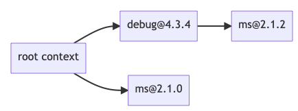
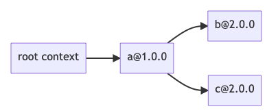
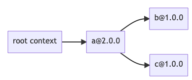
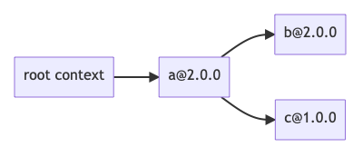

# Artifact for Dependency Solvers à la Carte

- [Artifact for Dependency Solvers à la Carte](#artifact-for-dependency-solvers-à-la-carte)
  - [Welcome](#welcome)
    - [How to read this document](#how-to-read-this-document)
  - [Getting to the Right Directory](#getting-to-the-right-directory)
  - [Example #1: Checking that MinNPM Runs Correctly](#example-1-checking-that-minnpm-runs-correctly)
  - [Example #2: Using MinNPM With Different Consistency Criteria](#example-2-using-minnpm-with-different-consistency-criteria)
  - [Example #3: MinNPM can Allow or Disallow Cyclic Solutions](#example-3-minnpm-can-allow-or-disallow-cyclic-solutions)
  - [Example #4: MinNPM can Find Solutions when NPM Fails](#example-4-minnpm-can-find-solutions-when-npm-fails)
  - [Example #5: MinNPM can Minimize Oldness](#example-5-minnpm-can-minimize-oldness)
  - [Example #6: MinNPM can Minimize Number of Dependencies](#example-6-minnpm-can-minimize-number-of-dependencies)

## Welcome

Welcome to the virtual machine which we have prepared to illustrate the functionality of PacSolve and MinNPM.

**General layout of the artifact**: All of the code is in the directory `~/Desktop/pacsolve`. Within that directory, the following sub-directories are of interest:

- `artifact/` contains this document, as well as a series of examples illustrating the functionality of MinNPM.
- `arborist/` and `npm/` contain the source code of our fork of NPM, which have been modified to solve dependencies by invoking PacSolve.
- `RosetteSolver/` contains the source code of PacSolve, which implements a flexible depenendency solving backend via translation to Max-SMT by using Rosette.

### How to read this document 
The rest of this document will proceed by following the series of examples contained in `artifact/`, to gain an understanding of how MinNPM functions on examples. **Every single command** which you are required to run will be annotated with a Step Number, some shell commands, and a possible box describing the expected command results, like so:

**Step 0:**

```bash
echo "example"
```

> Expected result: should print 'example' to the terminal


## Getting to the Right Directory

**Step 1:**
On the Desktop of the virtual machine, double click QTerminal, and then run:

```bash
cd ~/Desktop/pacsolve/artifact
```

From here on out, all commands will be run inside this shell.

## Example #1: Checking that MinNPM Runs Correctly

As a first example, we solve a trivial dependency example to verify that everything runs as expected, 
and to introduce the basic concepts for how to run MinNPM and how to compare outputs with vanilla NPM.

The scenario of the first example is described in this table:

| Package      |  Dep 1  |
|--------------|---------|
| root context | `a: *`  |
| `a@1.0.0`    |         |

meaning that the root solving context has a single dependency on any version of `a`, and `a` version 1.0.0 (the only version) has no dependencies.
For your reference, the directories inside `ex1_minnpm_runs/` encode this scenario with NPM packages which have already been uploaded to `npmjs.com`. 
As an example, package `a` version `1.0.0` is described by `ex1_minnpm_runs/a@1.0.0/package.json`, and has already been published as 
`@minnpm-artifact-examples/ex1-a` ([link](https://www.npmjs.com/package/@minnpm-artifact-examples/ex1-a)).

There is only one possible solution for this example, which is:


Let's check that both vanilla NPM and MinNPM find this solution.

**Step 2:**
```bash
pushd ex1_minnpm_runs/root_context
```

**Step 3:**
```bash
# Install packages with vanilla NPM
npm install
# Save the resulting lockfile, then clear solve results
cp node_modules/.package-lock.json result-vanilla.json; rm -rf node_modules package-lock.json
```

> Expected result: the install command should succeed. If not, please verify internet connectivity within the VM.

**Step 4:**
```bash
# Install packages with MinNPM
npm install --minnpm
# Save the resulting lockfile, then clear solve results
cp node_modules/.package-lock.json result-minnpm.json; rm -rf node_modules package-lock.json
```

> Expected result: the install command should succeed.

**Step 5:**
```bash
# Look at both results
tail -n +1 result-*.json
```

> Expected result: both result files should describe the solution graph drawn above, but
> there may be small differences in the result files, including possibly missing tarball URLs. 
> This does not affect functionality.

Running both the `npm` commands and the `cp` and `rm` commands each time is tedious, so we have included a script to automate this.
Let's repeat the above example by using the `compare_solvers` script:

**Step 6:**
```bash
compare_solvers vanilla minnpm='--minnpm'
```

> Expected result: both install commands should succeed, and `result-vanilla.json` and `result-minnpm.json` should be produced just as when done manually.

**Step 7:**
```bash
popd
```


## Example #2: Using MinNPM With Different Consistency Criteria

We now demonstrate that MinNPM can be configured to use 3 different consistency policies (NPM, Cargo, and PIP-style).

The scenario to solve in this example is precisely that of Figure 1 in the paper, which is summarized in the following table:


| Package       |    Dep 1    |     Dep 2     |
|---------------|-------------|---------------|
| root context  | `debug: *`  | `ms: < 2.1.2` |
| `debug@4.3.4` | `ms: 2.1.2` |               |
| `ms@1.0.0`    |             |               |
| `ms@2.1.0`    |             |               |
| `ms@2.1.2`    |             |               |

There is a potential conflict because `root context` and `debug@4.3.4` cannot agree on a version of `ms`.
MinNPM exposes 3 different polices for conflicts:

1. (NPM's policy): Freely allow co-installation of multiple versions, yielding this solution graph:

    

2. (Cargo's policy): Allow co-installation of versions which are **not** SemVer compatible. In this case, `ms@2.1.2` can be co-installed with `ms@1.0.0` but **not** `ms@2.1.0`, yielding this solution graph:

    

3. (PIP's policy): Disallow co-installation of multiple versions, yielding unsatisfiable constraints in this example.

Let's now observe MinNPM performing these solves in practice.

**Step 8:**
```bash
pushd ex2_consistency_criteria/root_context
```

**Step 9:**
```bash
# As a reminder, the minnpm-cargo line is equivalent to manually running
# npm install --minnpm --consistency cargo
compare_solvers \
    vanilla \
    minnpm-npm='--minnpm --consistency npm' \
    minnpm-cargo='--minnpm --consistency cargo' \
    minnpm-pip='--minnpm --consistency pip'
```

> Expected result: All solves except `minnpm-pip` should succeed. 
> The `result-vanilla.json` and `result-minnpm-npm.json` files should both contain the solution graph of policy (1) above, 
> and `result-cargo.json` should contain the solution graph of policy (2) above.


**Step 10:**
```bash
popd
```


## Example #3: MinNPM can Allow or Disallow Cyclic Solutions

On Page 13, *Incompleteness of Cargo* presents an example demonstrating a dimension in which Cargo is not a complete solver, 
because of its non-backtracking behavior when enforcing acyclic solutions. 
We present that example here (slightly simplified) to show how MinNPM (backed by PacSolve) 
can be configured to either allow or disallow cycles without sacrificing completeness.

The scenario to solve is:

| Package       |    Dep 1    |
|---------------|-------------|
| root context  |   `a: *`    |
|   `a@1.0.0`   |             |
|   `a@2.0.0`   |   `b: *`    |
|   `b@1.0.0`   | `a: 2.0.0`  |

There are exactly 2 solution graphs which satisfy this example, one with cycles and one without:


Let's try solving it both ways.

**Step 11:**
```bash
pushd ex3_cycles/root_context
```

**Step 12:**
```bash
# MinNPM allows cycles by default, the flag
# --disallow-cycles tells MinNPM to only look for acyclic solutions.
compare_solvers \
    vanilla \
    minnpm='--minnpm' \
    minnpm-acyclic='--minnpm --disallow-cycles'
```

> Expected result: All solves should succeed. 
> The `result-vanilla.json` and `result-minnpm.json` files should both contain the cyclic solution graph,
> and `result-minnpm-acyclic.json` should contain the acyclic solution graph.

Note that MinNPM prefers to choose the cyclic solution graph because it produces newer versions of dependencies.

**Step 13:**
```bash
popd
```


## Example #4: MinNPM can Find Solutions when NPM Fails

On Pages 12-13, *Incompleteness of NPM* presents an example demonstrating a dimension in which NPM is not a complete solver,
because it does not perform backtracking. When encountering an unsatisfiable constraint, NPM fails, whereas MinNPM can still
find a satisfying solution graph. For this example the scenario to solve is:

| Package       |    Dep 1    |
|---------------|-------------|
| root context  |   `a: *`    |
|   `a@1.0.0`   |             |
|   `a@2.0.0`   | `b: 9.9.9`  |
|   `b@1.0.0`   |             |

There is no solution graph in which the root context depends on `a@2.0.0`. The only solution graph is:


Let's try solving with both vanilla NPM and MinNPM.

**Step 14:**
```bash
pushd ex4_npm_incomplete/root_context
```

**Step 15:**
```bash
compare_solvers \
    vanilla \
    minnpm='--minnpm'
```

> Expected result: The MinNPM solve should succeed, and the NPM solve should fail.
> The `result-minnpm.json` file should contain the solution graph drawn above.


**Step 16:**
```bash
popd
```


## Example #5: MinNPM can Minimize Oldness

MinNPM finds globally optimal solution graphs, for some chosen minimization criteria. To see this in action, consider this scenario to solve:

| Package       |    Dep 1    |    Dep 2    |
|---------------|-------------|-------------|
| root context  |   `a: *`    |             |
|   `a@1.0.0`   | `b: 2.0.0`  | `c: 2.0.0`  |
|   `a@2.0.0`   | `b: 1.0.0`  | `c: 1.0.0`  |
|   `b@1.0.0`   |             |             |
|   `b@2.0.0`   |             |             |
|   `c@1.0.0`   |             |             |
|   `c@2.0.0`   |             |             |

There are exactly 2 possible solution graphs, corresponding to which version of `a`:





The first solution graph has an old version of `a`, but new versions of `b` and `c`. The second graph has a new version of `a`, but old versions of `b` and `c`. 
Let's try using MinNPM to minimize the total oldness in the solution.

**Step 17:**
```bash
pushd ex5_min_oldness/root_context
```

**Step 18:**
```bash
# By default, MinNPM minimizes the total oldness in the solution, so
# we don't need to specify any additional flags.
compare_solvers \
    vanilla \
    minnpm='--minnpm'
```

> Expected result: both solves should succeed.
> The `result-vanilla.json` file should contain the solution graph with (`a@2.0.0`; `b@1.0.0`; `c@1.0.0`),
> and the `result-minnpm.json` file should contain the solution graph with (`a@1.0.0`; `b@2.0.0`; `c@2.0.0`)


**Step 19:**
```bash
popd
```

## Example #6: MinNPM can Minimize Number of Dependencies

MinNPM can also be configured to minimize the total number of dependencies in the solution graph.
Consider solving this situation:

| Package       |    Dep 1    |    Dep 2    |
|---------------|-------------|-------------|
| root context  |   `a: *`    |             |
|   `a@1.0.0`   |   `b: *`    |             |
|   `a@2.0.0`   |   `b: *`    |   `c: *`    |
|   `b@1.0.0`   |             |             |
|   `b@2.0.0`   |             |             |
|   `c@1.0.0`   |             |             |

There are exactly 4 possible solution graphs, corresponding to which versions of `a` and `b`:




The first two solution graphs have an old version of `a`, but one fewer dependency. 
By default MinNPM prefers to choose the newer version of `a`,
but we can configure its minimization criteria to prioritize getting fewer dependencies.

**Step 20:**
```bash
pushd ex6_min_num_deps/root_context
```

**Step 21:**
```bash
# The default value for --minimize if unspecified is:
# --minimize min_oldness,min_num_deps
compare_solvers \
    vanilla \
    minnpm-min-oldness-then-num-deps='--minnpm' \
    minnpm-min-num-deps-then-oldness='--minnpm --minimize min_num_deps,min_oldness'
```

> Expected result: all solves should succeed.
> The `result-vanilla.json` and `result-minnpm-min-oldness-then-num-deps.json` files and should contain the solution graph with (`a@2.0.0`; `b@2.0.0`; `c@1.0.0`),
> and the `result-minnpm-min-num-deps-then-oldness.json` file should contain the solution graph with (`a@1.0.0`; `b@2.0.0`)

Note that because we minimize `min_oldness` at second priority, we get a solution with `b@2.0.0` rather than `b@1.0.0`, as that does not affect graph size.

**Step 22:**
```bash
popd
```

